# Milestone 2
COGS 121, SP18.
Team COGO's Submission for Milestone 2.

## Storyboards
### Storyboard 1

### Story Board 2
#### The individual will be traveling to Bolivia in a few months. In preparation for the trip, they use the app to learn and practice Spanish. Once in Bolivia, they have minimal issues in communicating with others in Spanish. 
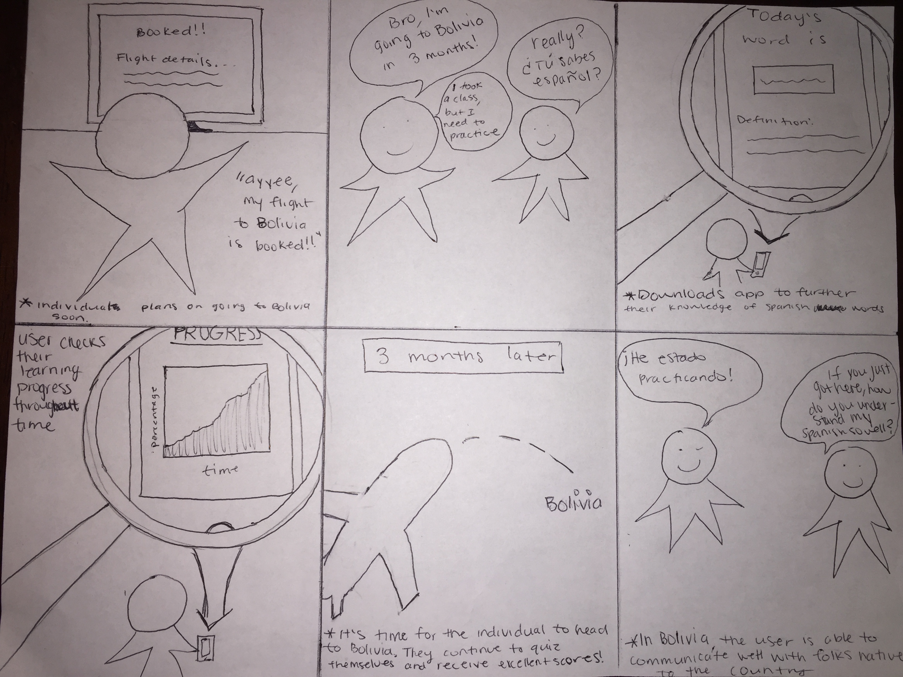

## Prototypes
### Prototype 1
#### Home Page

#### Switching to Japanese

#### Clicking Calendar Icon

#### Switched to Yesterday
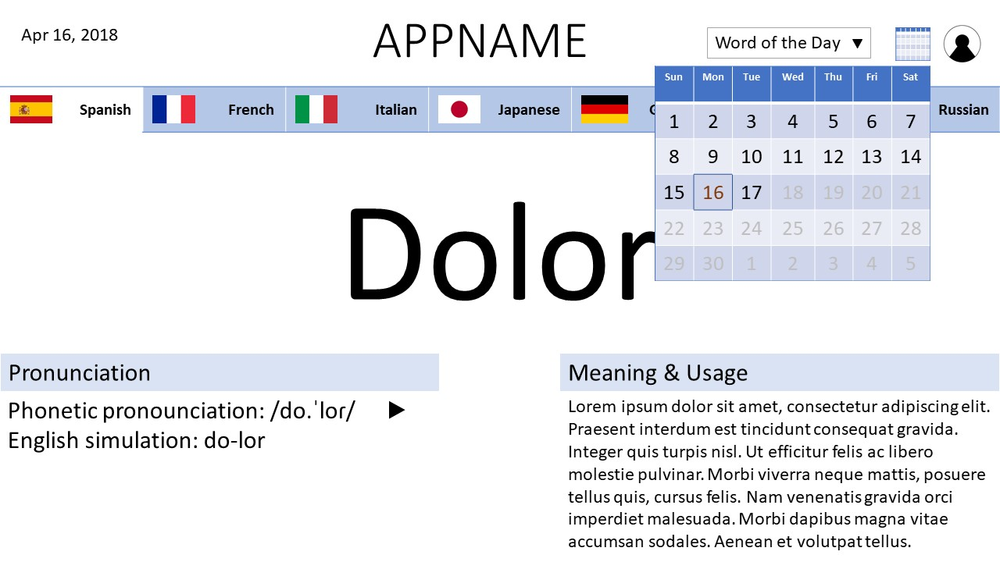
#### Selecting Word Category

#### Switched to Food
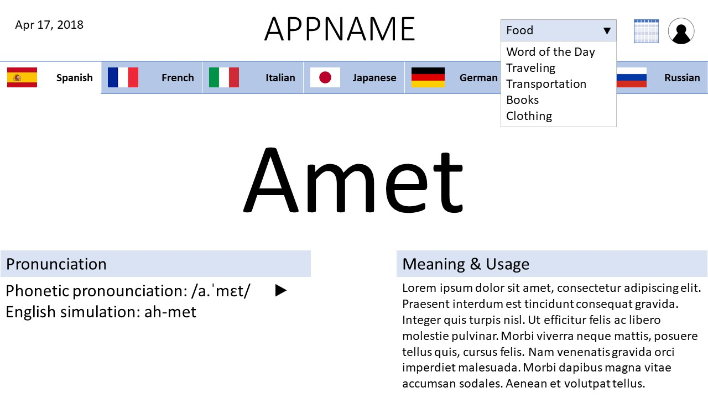
#### Clicking User Icon to Sign In

#### New Account Creation
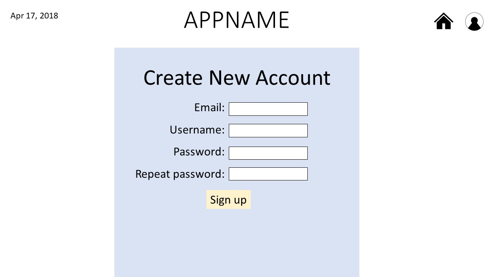
#### Forgot Password

#### After Login

#### Account Info

#### History Page
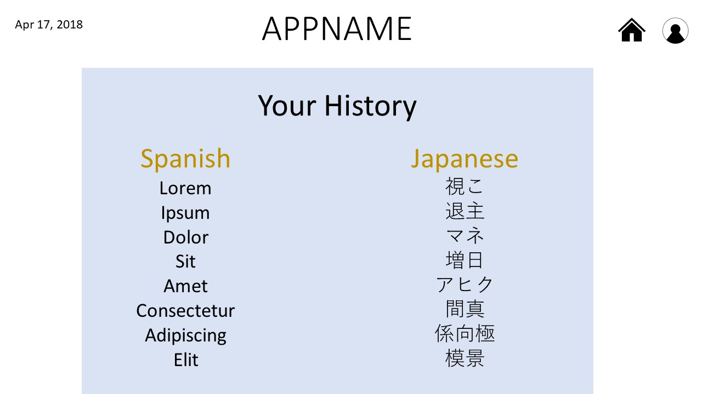
#### Quizzes Selection 1
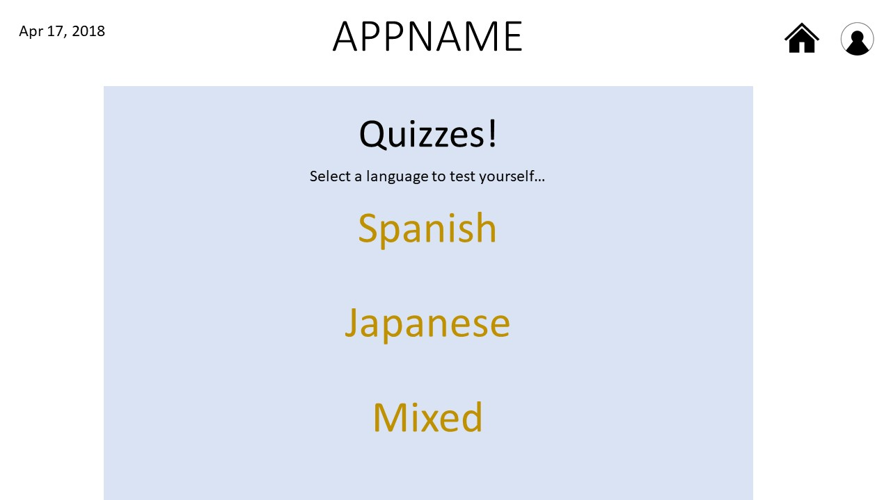
#### Quizzes Selection 2
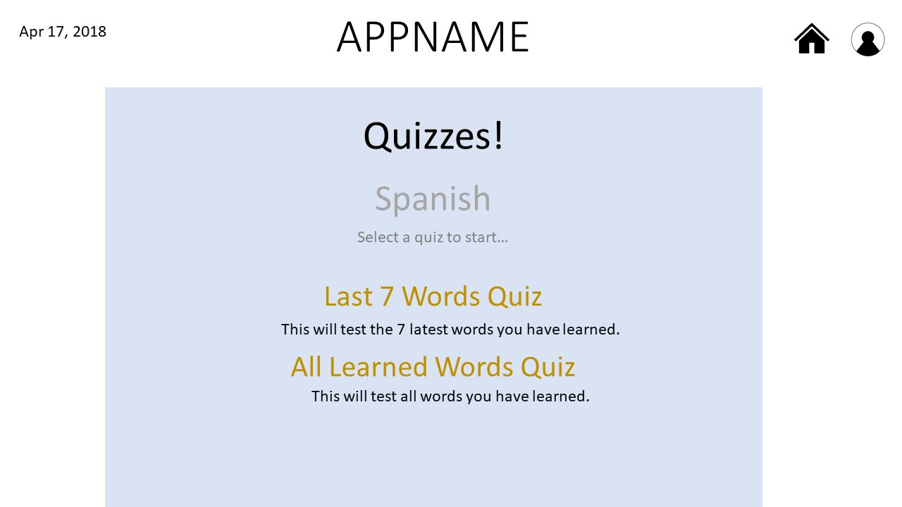
#### Quizzes Question

#### Quizzes Correct

#### Quizzes Incorrect
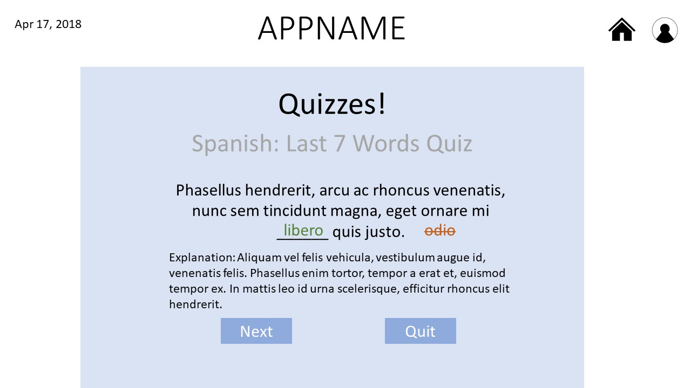

### Prototype 2
#### Login Screen
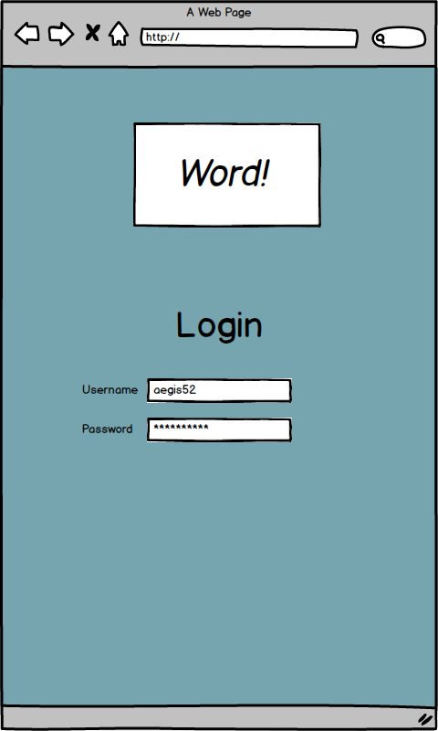
#### Home page
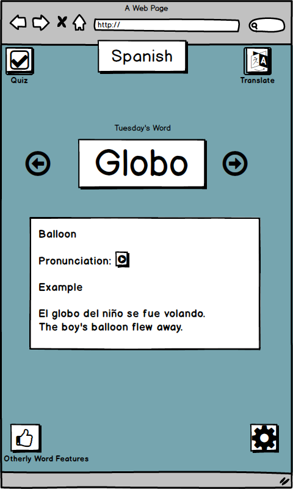
#### Language Selected
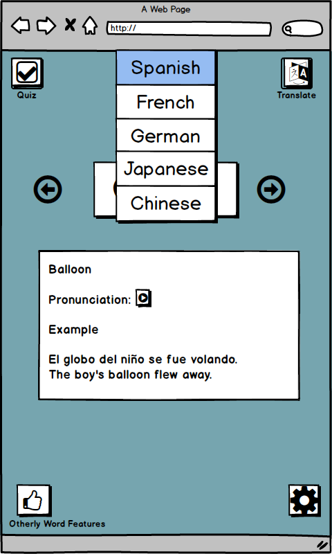
#### Monday's Word Selected

#### Monday's Word
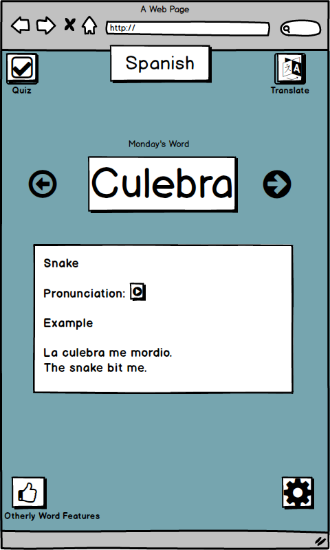
#### Quiz Selected

#### Quiz
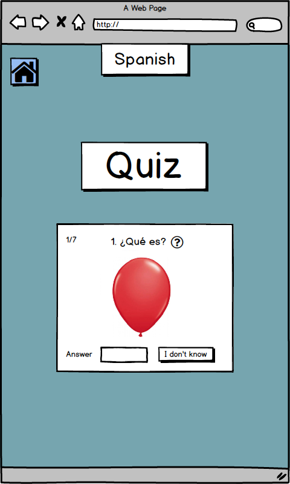
#### Translate Selected
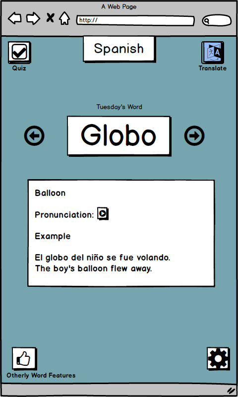
#### Translate
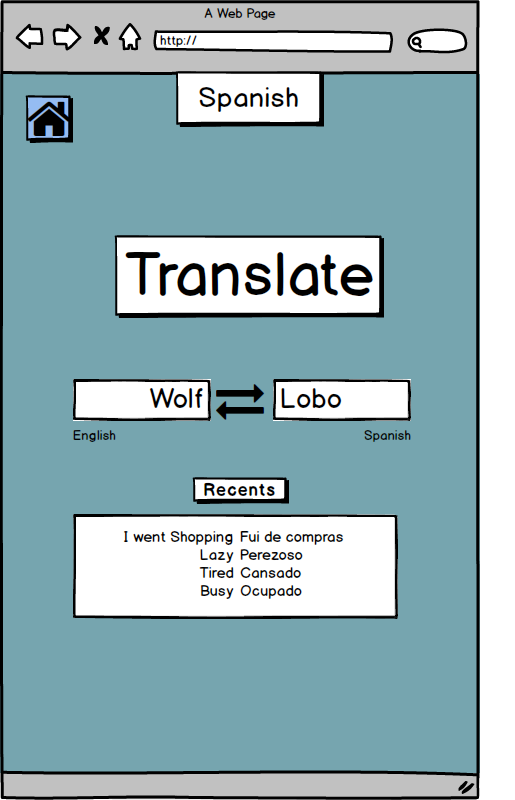
#### Words Learned Selected
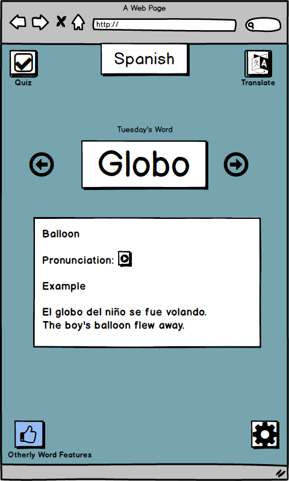
#### Other Features
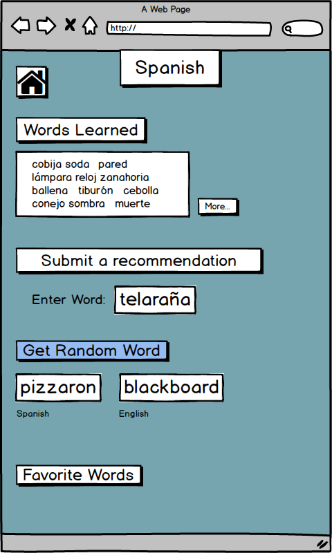
#### Settings Selected
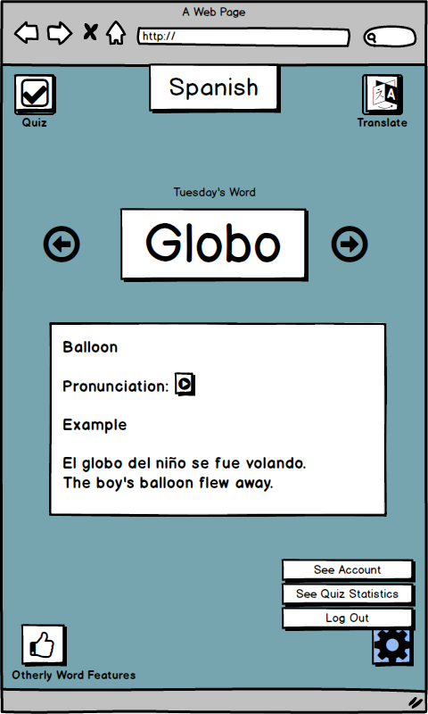