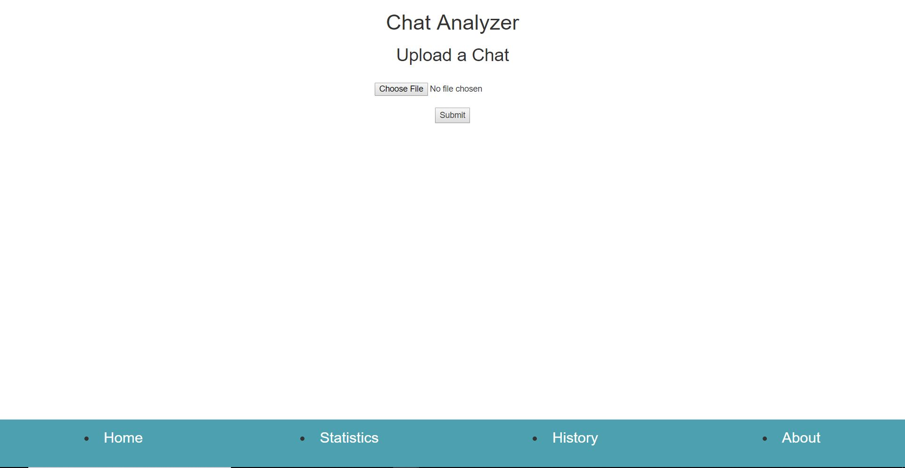
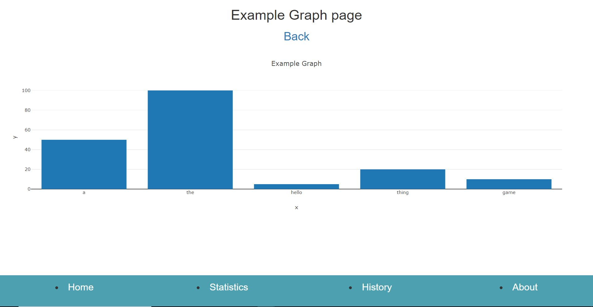
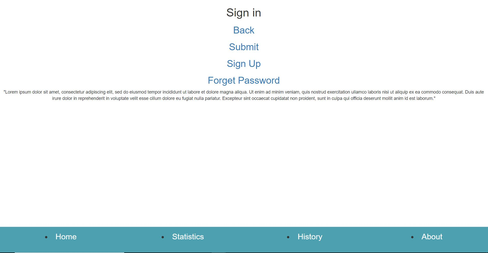

# UI Skeleton vs Prototype

## Skeletons
### Home Page

### Statistics

### Signin page

### About page

Difference explained:
Our skeleton is entirely different from our prototypes since its a very different idea. For our skeleton we now have a four button layout at the bottom of our home screen for navigation. This navigation bar follows the user on each page they visit so they can easily choose whichever page to be on at any point. Seeing how are idea of graphing a chat log how one main idea, our home screen has that function right at the start to get straight to the point.
